# Trabalho Prático - Banco de Dados I - BCC321

<table>
  <tr>
    <td align="center"><a href="https://www.linkedin.com/in/ana-cristina-lopes-b69610167/"><br /><sub><b>Ana Cristina</b></sub></a><br /></td>
    <td align="center"><a href="https://www.linkedin.com/in/gustavo-barbosa-39829819b/"><br /><sub><b>Gustavo Barbosa</b></sub></a><br /></td>
    <td align="center"><a href="https://www.linkedin.com/in/gustavofariaa/"><br /><sub><b>Gustavo Amorim</b></sub></a><br /></td>
    <td align="center"><a href="https://www.linkedin.com/in/mateuss-oliveira/"><br /><sub><b>Mateus Oliveira</b></sub></a><br /></td>
    <td align="center"><a href="https://www.linkedin.com/in/sawtorugo/"><br /><sub><b>Vitor Hugo</b></sub></a><br /></td>
    </tr>
</table>

## Banco de Dados
Dado um problema fictício de controle interno de uma loja física de venda de roupas, sapatos e acessórios, o grupo implementou um sistema capaz de gerenciar produtos e funcionários, além de manter históricos de compras, estoque e fornecedores. 

### Concepção
Foram levantados requisitos necessários ao sistema e cridas as histórias dos usuários. A partir das informações coletadas, foram definidos os dados necessários para construção do banco de dados.

### Diagrama Entidade Relacionamento Estendido
A partir dos dados levantados, foram aplicados os conceitos de Modelagem Entidade Relacionamento Estendido para gerar o Diagrama ERE.
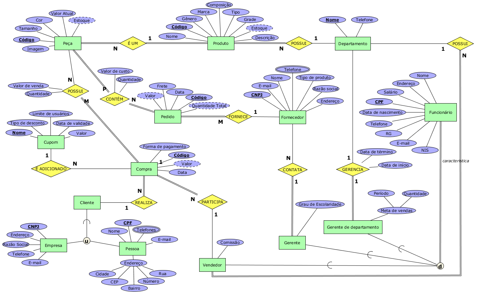

### Mapeamento para Esquema Relacional
Com o Diagrama ERE formulado, foram aplicadas as regras de Mapeamento para Esquema Relacional, obtendo então o Esquema Lógico.

### Geração do Script SQL
A partir do Esquema Lógico foi possível codificar o script SQL, respeitando as regras da linguagem, para gerar e popular o banco de dados.

## Infraestrutura
A fim de deixar o banco de dados disponível de forma remota, ele foi implantado na plataforma Google Cloud.

### Criação de uma instância de VM

- Selecionar SQL

  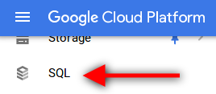

- Criar instância do Google Cloud SQL

  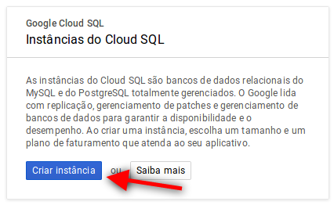
  
- Escolher o PostgreSQL

  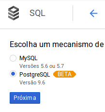
  
- Definir configurações da instância

  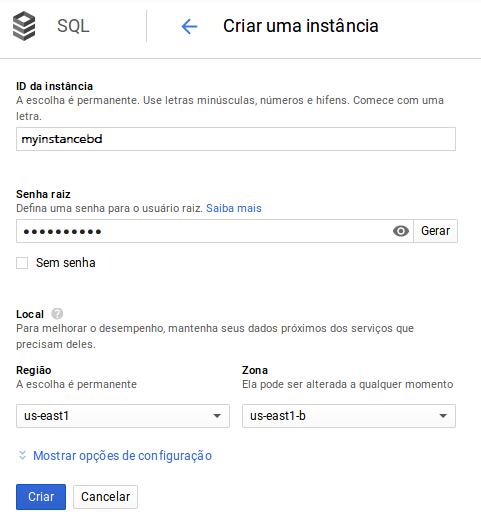
  
- Visualizar o status da instância e algumas informações

  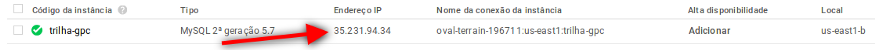
  
- Criar e nomear um banco de dados
  
  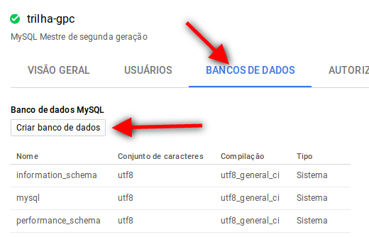
  
- Criar usuários

  
  
- Configurar autorização de rede

  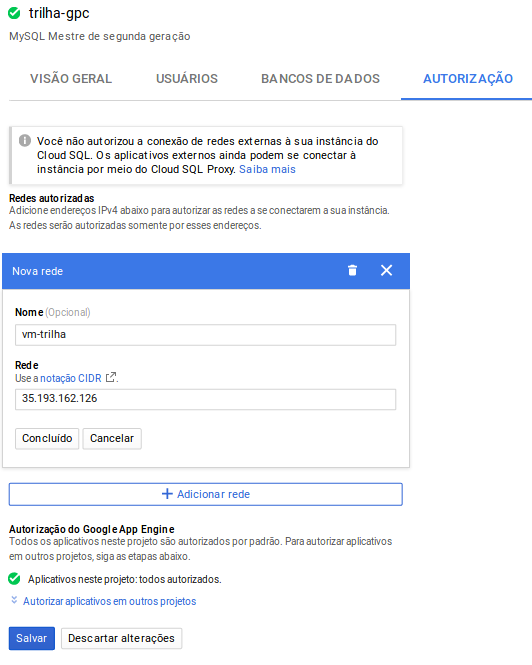

### Conexão com Banco de Dados Remoto

Para administrar o banco de dados foi utilizado o [DBeaver](https://dbeaver.io/) que é um aplicativo de software cliente SQL.

- Selecionar PostgreSQL

  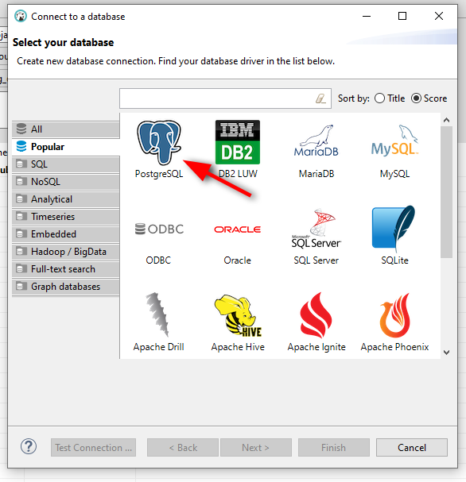
  
- Preencher campos Host, Post, Database, Username e Password

  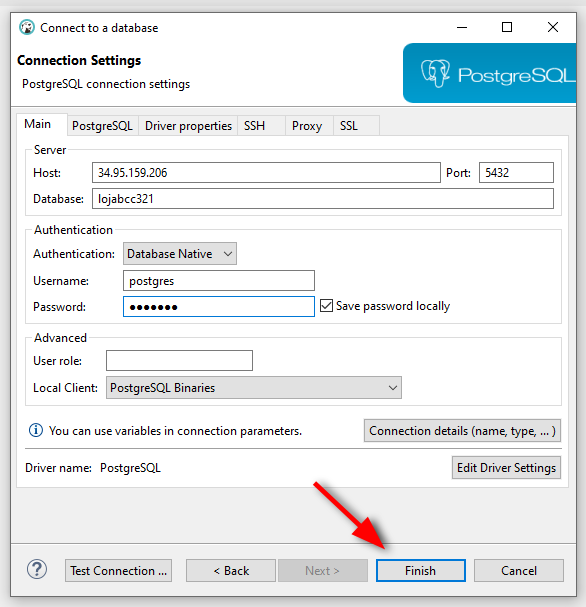

### Execução do Script SQL

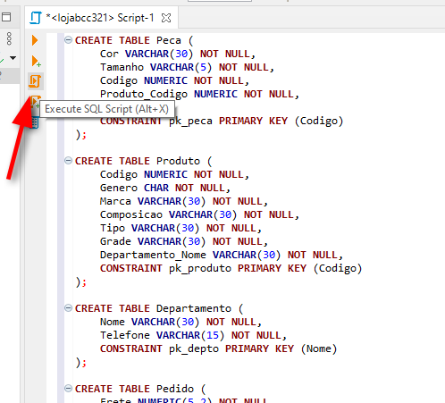

## Implementação do Sistema
A implementação do sistema web utilizou as seguintes tecnologias: 
- [Next.js](https://nextjs.org/)
- [ReactJS](https://reactjs.org/)
- [UIkit](https://getuikit.com/)
- [node-postgres](https://www.npmjs.com/package/pg)

### Criação da API Rest
A API Rest utiliza o protocolo de comunicação HTTP utilizando os métodos GET, POST, PUT e DELETE. Em nosso sistema utilizaremos os métodos nas seguintes rotas:
- [Retornar todos os produtos](https://github.com/gustavofariaa/BCC321-TP2/blob/main/src/pages/api/products/index.js)
    ```
    GET api/products
    ```
- [Retornar um produto específico](https://github.com/gustavofariaa/BCC321-TP2/blob/main/src/pages/api/products/%5Bpid%5D.js)
    ```
    GET api/products/:id
    ```
- [Editar um produto específico](https://github.com/gustavofariaa/BCC321-TP2/blob/main/src/pages/api/products/%5Bpid%5D.js)
    ```
    PUT api/products/:id
    ```
- [Retornar todos os produtos de um determinado gênero](https://github.com/gustavofariaa/BCC321-TP2/blob/main/src/pages/api/products/filters/gender/%5Bvalue%5D.js)
    ```
    GET api/products/filters/gender/:value
    ```
- [Retornar todos os produtos de um determinado tamanho](https://github.com/gustavofariaa/BCC321-TP2/blob/main/src/pages/api/products/filters/size/%5Bvalue%5D.js)
    ```
    GET api/products/filters/size/:value
    ```
- [Retornar todos os produtos de um determinado tipo](https://github.com/gustavofariaa/BCC321-TP2/blob/main/src/pages/api/products/filters/type/%5Bvalue%5D.js)
    ```
    GET api/products/filters/type/:value
    ```

## Artefatos
- [Mapeamento ERE para Relacional](https://github.com/gustavofariaa/BCC321-TP2/blob/main/artifacts/mapeamentoRelacional.txt)
- [Script SQL](https://github.com/gustavofariaa/BCC321-TP2/blob/main/artifacts/script.sql)
